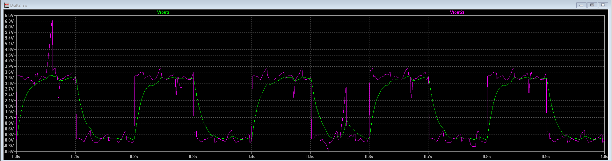
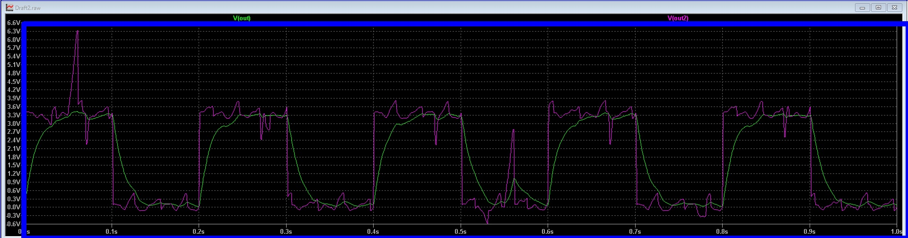
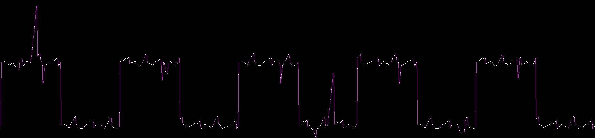
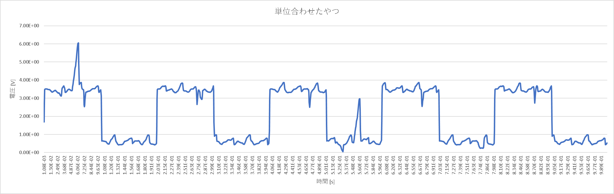
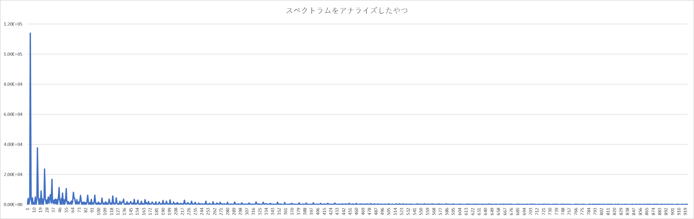

### 2024/04/07  F.Sato

  ░▄▀▄▀▀▀▀▄▀▄░░░░░░░░░  
  ░█░░░░░░░░▀▄░░░░░░▄░  
  █░░▀░░▀░░░░░▀▄▄░░█░█  
  █░▄░█▀░▄░░░░░░░▀▀░░█  
  █░░▀▀▀▀░░░░░░░░░░░░█  
  █░░░░░░░░░░░░░░░░░░█  
  █░░░░░░░░░░░░░░░░░░█  
  ░█░░▄▄░░▄▄▄▄░░▄▄░░█░  
  ░█░▄▀█░▄▀░░█░▄▀█░▄▀░  
  ░░▀░░░▀░░░░░▀░░░▀░░ 

# オシロスコープのスクショからスペクトラム分析するやつ(Python版)

# 動作環境
## python3.10.4(確認済み)

# 必要なライブラリ
## opencv-python
## numpy
## keyboard
### 以下のコマンドで一括インストールできる．
    pip install -r requirements.txt

# ダウンロードの仕方
## gitコマンドを使用する場合
### 以下のコマンドを任意のディレクトリで実行
    git clone https://github.com/Awattson/stf_anapyzer.git

## zipでダウンロードする場合
1. 画像に示されたボタンをクリック

2. zip形式でのダウンロードを選択

3. zipは解凍(展開)しよう

# 使い方
    python fst.py
    python snd.py

1. コマンドプロンプトを開こう
2. cdでAnaPyzerまで移動
3. 解析したいスクショを用意

4. pythonでfst.pyを実行

5. pythonでsnd.pyを実行

6. fst.py, snd.pyは"q"を押せば終了する
7. AnaPyzer/resultにpower_spectrum.csvが生成される．それがスペクトル解析したデータ
もう片方のcsvファイルはスクショの波形をcsvに変換したもの

